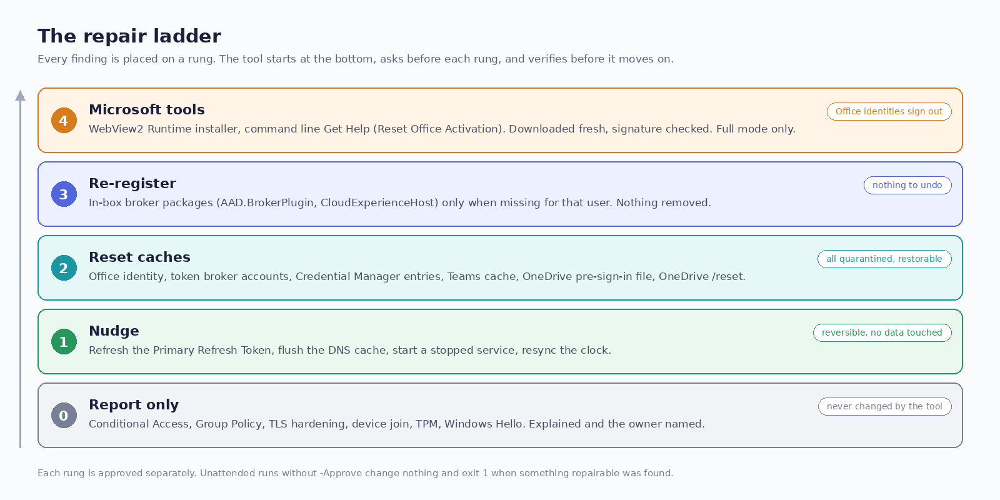
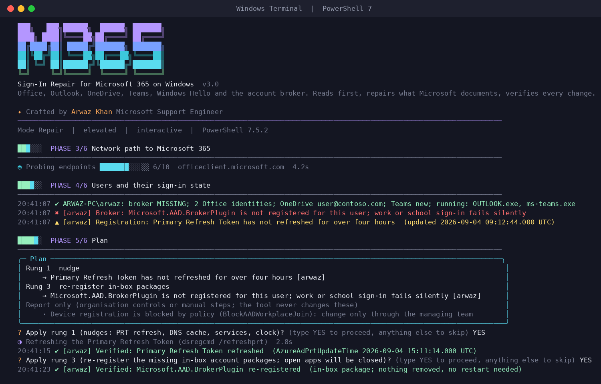

<p align="center">
  
</p>

<h1 align="center">M365 Sign-In Repair</h1>

<p align="center">
  Reads first. Repairs what Microsoft documents. Verifies every change.<br>
  One PowerShell script for the sign-in failures that hit Office, Outlook, OneDrive, Teams and Windows Hello on Windows 10 and 11.
</p>

<p align="center">
  <a href="#run-it"></a>
  <a href="#run-it"></a>
  <a href="docs/sources.md"></a>
  <a href="LICENSE"></a>
  <a href=".github/workflows/test.yml"></a>
</p>

<br>

## The problem

A user opens Outlook and gets "We couldn't sign you in". Teams shows CAA50021. OneDrive says 0x8004de40. Word wants a password it already has. The cause is almost never in the app that shows the error. It is somewhere in a stack most people never see: the Web Account Manager broker, the device's Primary Refresh Token, the token caches Office keeps in six different places, a proxy that inspects TLS, a clock that drifted, or a policy someone set on purpose.

The usual response is a list of forum steps applied in the wrong order, on the wrong account, from an elevated prompt that changes the administrator's profile instead of the user's. Half of them are destructive. Some of them, like `dsregcmd /leave` on a hybrid-joined PC, can lock the user out for good.

This tool replaces that list with a procedure.

## What it does

It reads the entire sign-in stack, shows you a plan, and applies the least destructive repair that Microsoft documents for what it found, one rung at a time, each one approved separately, each one verified afterwards.

<p align="center">
  
</p>

| Rung | What happens | Reversible |
|---|---|---|
| 0 | **Report only.** Tenant policy, Conditional Access, Group Policy values, TLS hardening, device join, TPM, Windows Hello. The tool explains and points to the owner. It never changes these. | not applicable |
| 1 | **Nudge.** Refresh the Primary Refresh Token, flush the DNS cache, start a stopped service that should run, resync the clock. | yes |
| 2 | **Reset caches.** Office identity (OneAuth, IdentityCache, licence files, identity registry keys), token broker account blobs, Credential Manager entries for Office, OneDrive and Teams, the Teams cache, OneDrive's pre-sign-in file, then OneDrive `/reset`. Everything moved is kept in a quarantine folder with restore instructions. | yes |
| 3 | **Re-register.** The in-box `Microsoft.AAD.BrokerPlugin` and `CloudExperienceHost` packages, only when they are actually missing for that user. Nothing is removed. | nothing to undo |
| 4 | **Microsoft tools.** Install the WebView2 Runtime, or run the command line version of Get Help (`ResetOfficeActivation`). Downloaded fresh, signature checked, Full mode only. | Office identities sign out |

Every finding carries the Microsoft article it came from. Every action ends in one of five states: Verified, NotVerified, Skipped, Failed, or WhatIf. "Applied" alone is never reported as success.

## Run it

Open PowerShell as the affected user and paste one line. With no parameters the tool shows a start menu: Diagnose, Repair, Full, Dry run, Decode an error code, or Quit; then which apps; then the error code from the dialog if you have one.

```powershell
irm https://raw.githubusercontent.com/bluespam-cyber/m365-signin-repair/main/Repair-M365SignIn.ps1 -OutFile "$env:TEMP\Repair-M365SignIn.ps1"; & "$env:TEMP\Repair-M365SignIn.ps1"
```

Or skip the menu by saying what you want on the command line:

```powershell
& "$env:TEMP\Repair-M365SignIn.ps1" -Mode Repair -ErrorCode CAA50021
```

Diagnose changes nothing and ends with the HTML report and a plan. Repair asks before each rung: type `YES` to proceed, anything else to skip that rung and continue. Pass the error code whenever you have one; the documented repairs for the account broker are keyed to it, and without a code the tool will tell you that no rung applies rather than guess.

Both PowerShell 7 (`pwsh`) and Windows PowerShell 5.1 work. Windows Terminal gives the best visuals.

<details>
<summary><b>More ways to run it</b></summary>

```powershell
# Only decode error codes; nothing is inspected
.\Repair-M365SignIn.ps1 -DecodeOnly -ErrorCode 0x8004de40, AADSTS50076, -2147024809

# Dry run of a repair: every change is printed, none is made
.\Repair-M365SignIn.ps1 -Mode Repair -ErrorCode CAA50021 -WhatIf

# Focus on OneDrive and the broker for one user, from an elevated prompt
.\Repair-M365SignIn.ps1 -Mode Repair -Apps OneDrive, Broker -TargetUserSid S-1-12-1-...

# Everything the tool can do on an unmanaged device, with a case number in the report
.\Repair-M365SignIn.ps1 -Mode Full -CaseNumber 1234567890

# Intune remediation or RMM, running as SYSTEM: repairs each signed-in user inside their own session
.\Repair-M365SignIn.ps1 -Mode Repair -AllUsers -Approve Nudge, Reset, Reregister -NonInteractive
```

| Parameter | Meaning |
|---|---|
| `-Mode` | `Diagnose` (read-only), `Repair` (rungs 1 to 3 for the user), `Full` (adds elevated machine repairs and rung 4). Omit it in a console window to get the start menu; unattended runs default to Diagnose |
| `-Apps` | `Office`, `Outlook`, `OneDrive`, `Teams`, `Broker`; default all |
| `-ErrorCode` | One or more codes from the dialog. Decoded, routed to the right rung, and used to focus the plan |
| `-Approve` | Pre-approve rungs for unattended runs: `Nudge`, `Reset`, `Reregister`, `Tool`. Without it, an unattended run changes nothing |
| `-TargetUserSid` | Repair one specific user (elevated). Entra ID users have SIDs starting `S-1-12-1` |
| `-AllUsers` | Every signed-in user (elevated) |
| `-SkipNetwork` | Skip the endpoint, TLS, DNS and time probes |
| `-OutputRoot` | Where the run folder goes. Default `%LOCALAPPDATA%\M365SignInRepair`, or `%ProgramData%\M365SignInRepair` when elevated |
| `-CaseNumber` | Written into the report and case notes |
| `-NonInteractive`, `-Quiet`, `-NoOpenReport` | For scripts and RMM. Implied when there is no console |
| `-WhatIf` | Standard dry run |

</details>

## What a run looks like

<p align="center">
  
</p>

Six phases, each with a progress track: device and platform, device registration and event logs, network path to Microsoft 365, users and their sign-in state, plan and repair, report. Every wait is alive: a spinner on a background thread with the sub-step it is on ("Probing endpoints [######......] 6/10 officeclient.microsoft.com"), a running elapsed counter, and a colour pulse from violet to mint. The same spinner follows every repair, so closing apps, waiting for OneDrive to exit, re-registering a package, downloading a Microsoft tool or waiting for a per-user session all show what is happening and for how long. Nothing is faked: no artificial delays, and the spinner thread only draws under a lock, so it can never land on top of a finding. Under Windows Terminal you get the full symbol set; in the classic console, in RMM output, or with `NO_COLOR` set, everything degrades to plain text automatically.

## What it checks

<details>
<summary><b>Device and platform</b></summary>

Windows build and support status, pending reboot, free disk, the services the sign-in stack depends on (TokenBroker, Microsoft Account Sign-in Assistant, Click-to-Run, Cloud Files filter, Network Location Awareness, Windows Time), WebView2 Runtime in both registry views, TLS 1.2 posture in Schannel, .NET and WinHTTP, the cipher suite policy, automatic root update, the presence of the DigiCert and Microsoft roots that Microsoft 365 chains to, policies that block Microsoft accounts or device registration, OneDrive tenant and sync policies, Office Click-to-Run identity (platform, channel, build, shared computer activation), clock source and offset against `time.windows.com`.
</details>

<details>
<summary><b>Device registration</b></summary>

`dsregcmd /status` parsed into facts: join type from the documented matrix (Entra joined, hybrid, domain, registered), device authentication status, key health, Primary Refresh Token presence and age, the WAM default account, Windows Hello key and reset capability, TPM protection. The AAD Operational log and the User Device Registration log for the last 24 hours, with the event IDs Microsoft documents (1098 token broker failure, 1081 and 1088 server errors, 304, 305, 307 registration failures).
</details>

<details>
<summary><b>Network path</b></summary>

WinHTTP and WinINet proxies (they are independent; the broker follows one, the apps follow the other), PAC reachability, DNS answers for the sign-in hosts with sinkhole detection, HTTPS reachability of the identity endpoints from Microsoft's endpoint sets 56 and 59 plus the workload endpoints for the apps in scope, and a TLS handshake that reads the certificate issuer without trusting it, which is how interception by a proxy or antivirus is detected.
</details>

<details>
<summary><b>Per user</b></summary>

Whether the broker packages are registered for that user, the size and contents of the identity caches, the token broker account blobs, Credential Manager entries for Office, OneDrive and Teams, the Office identity policies in both the user and the policy hives (SignInOptions, EnableADAL, DisableAADWAM, BlockAADWorkplaceJoin), cached Office identities and profiles, subscription licence state through `vnextdiag.ps1`, Outlook Autodiscover exclusions and modern authentication settings, the Teams Meeting add-in, OneDrive account, version, OneAuth failure marker and pre-sign-in file, new and classic Teams caches, the Teams cloud pin, and which of these apps the user has running.
</details>

<details>
<summary><b>Error codes</b></summary>

Seventy codes across the broker (CAA*), Windows Hello and TPM (8009*), Office activation, OneDrive (8004de*), WinINet and Entra (AADSTS*), each with its meaning, its owner (client, tenant, network or device), the rung that addresses it, and its source. Codes Microsoft does not document individually are labelled as such and routed to the read-only ladder; they never trigger a destructive step. Server-side AADSTS codes are explained and handed to the administrator; the tool does not try to fix a tenant policy by clearing local state.
</details>

## What it refuses to do

These are deliberate. Each is either an organisation control or something Microsoft lists as a last resort for a human.

- `dsregcmd /leave` or `/forcerecovery`. Leaving a hybrid-joined device from a tool can strip the PRT and Windows Hello with no guarantee of rejoining.
- `Clear-Tpm`, deleting the Ngc folder, or clearing `HKCU\...\AAD\Storage`. The supported PIN repair is "I forgot my PIN" in Settings.
- Editing Schannel, cipher order, .NET or WinHTTP TLS values, proxies, the hosts file, DNS servers, firewall rules, or importing a certificate authority. Reported with the exact key and the owner to contact.
- Changing any value under a `Policies` hive, tenant allow or block lists, Conditional Access, or licences.
- Deleting anything. Removals are moves into a quarantine folder on the same volume, never inside a OneDrive-synced path, with `RESTORE-INSTRUCTIONS.txt` written before the first move.
- Touching another user's profile from SYSTEM. Per-user state is repaired inside that user's own session through a temporary scheduled task, never through `HKEY_USERS` or `.DEFAULT`.
- Rebooting. When a step needs one (token broker account reset, TLS changes) the report says so.

## Safety model

**Approval per rung.** Interactive runs ask before each rung. `-Approve` pre-approves named rungs for unattended use. An unattended run without `-Approve` changes nothing and exits 1 if it found something repairable, which is exactly the Intune detection contract.

**Verified, not applied.** After every change the tool checks the result: the package is registered, the folder is empty, the credential is gone, the PRT timestamp moved, the service is running, the clock is within a minute. Only then does it say Verified.

**Everything is recorded.** `result.json` for machines, `report.html` for people, `CASE-NOTES.txt` to paste into a ticket, `run.log` with every step, `dsregcmd-status.txt`, and the quarantine with its restore instructions. If the run is interrupted, the report is still written.

**Exit codes.** 0 healthy or every repair verified. 1 a repairable issue exists and nothing (or not everything) was done. 2 something was changed but not verified. 3 stopped early.

## Intune and RMM

Run as SYSTEM with `-AllUsers -Approve Nudge, Reset, Reregister -NonInteractive`. The tool inspects the device in the SYSTEM context, then launches itself once per signed-in user inside that user's session (interactive token, highest available privilege) through a scheduled task it creates and removes. Each child writes its own result, the parent merges them and returns the worst exit code. Use the same script as the detection script with `-Mode Diagnose`: exit 1 means run the remediation.

Two things to know. Per-user Appx re-registration and Credential Manager changes need the user to be signed in; a locked screen is fine, a signed-out user is skipped and reported. And the machine-level rungs (services, clock, WebView2) run in the SYSTEM process, not in the children, because a standard user cannot do them.

## Test it without a broken PC

`scripts\Test-RepairM365SignIn.ps1` runs the whole ladder against a fake, broken sign-in state: a missing broker package, a stale PRT, a cached Office identity, a OneDrive failure marker, a Credential Manager entry. Every Windows dependency the tool calls is shadowed, so nothing real is read or changed, and it needs no elevation. Five scenarios, thirty checks, about one minute.

```powershell
.\scripts\Test-RepairM365SignIn.ps1
```

## Files

```
Repair-M365SignIn.ps1            the tool
scripts/Test-RepairM365SignIn.ps1  offline test with shadowed Windows dependencies
docs/how-it-works.md             the ladder, the checks, the decision rules
docs/sources.md                  79 Microsoft articles, one per check and repair
docs/troubleshooting.md          when the tool itself cannot proceed
assets/                          banner and illustrations
```

## Requirements

Windows 10 or 11. Windows PowerShell 5.1 or PowerShell 7. No modules to install. Elevation is optional: without it the tool diagnoses and repairs the current user's own caches; with it, it can also re-register packages, fix services and the clock, and target other users.

## Author

Arwaz Khan, Microsoft Support Engineer.

Built the same way as [SPO UID](https://github.com/bluespam-cyber/spo-user-id-mismatch): dry run first, one source per claim, nothing deleted, everything verified. Issues and pull requests are welcome; see [CONTRIBUTING.md](CONTRIBUTING.md).
